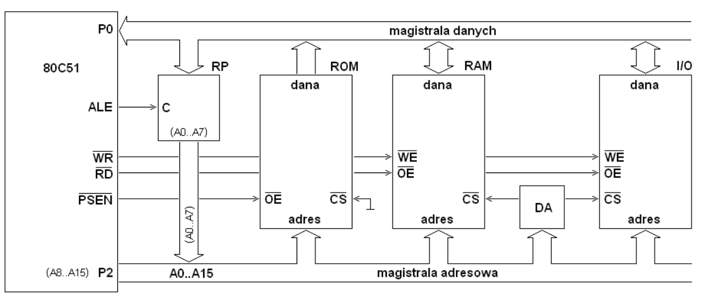
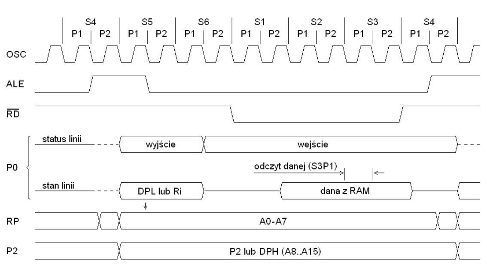
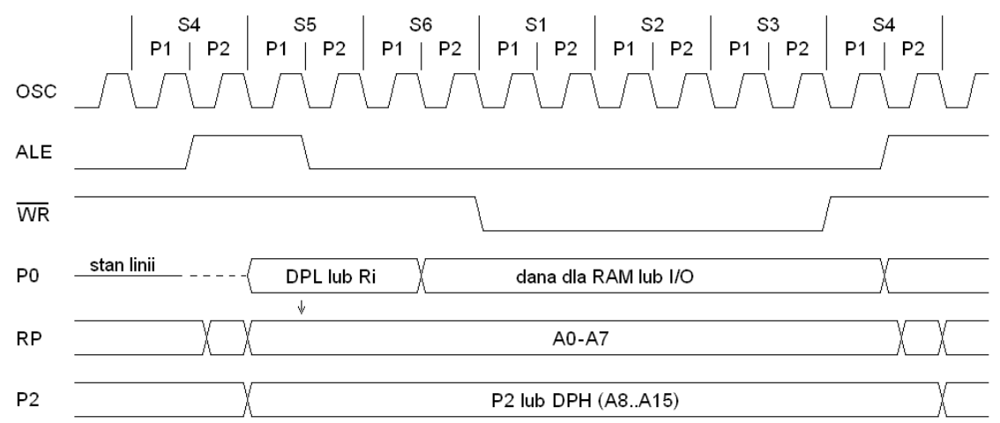
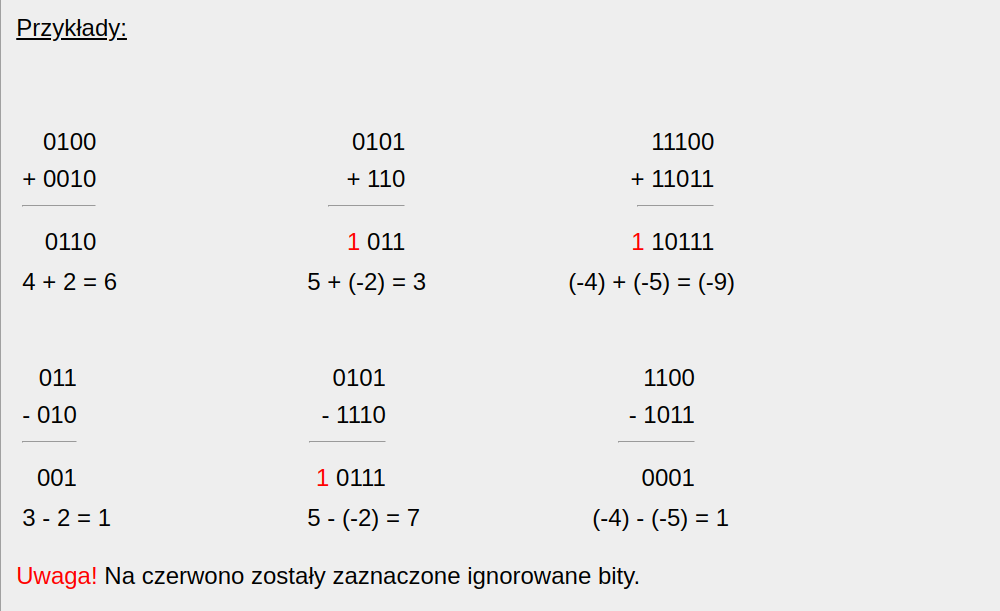

# Asyko i systemy wbudowane

[`back to README.md`](../README.md)

## 28. Różnice pomiędzy obsługą zdarzeń w przerwaniach sprzętowych a obsługą zdarzeń w pętli programowej

### Przerwania sprzętowe

**Przerwanie** — sygnał wysyłany przez urządzenie do procesora, który powoduje wstrzymanie wykonywania programu i przejście do obsługi przerwania. Po zakończeniu obsługi przerwania procesor wraca do wykonywania przerwanego programu. (Zmienia przepływ sterowania)

Rodzaje przerwań sprzętowych:

* **Zewnętrzne** — generowane przez urządzenia zewnętrzne (np. klawiatura, mysz, karta sieciowa, itp.), podłączenie urządzenia do procesora odbywa się za pomocą linii przerwań (IRQ).
* **Wewnętrzne** — generowane przez wewnętrzne układy procesora (np. błąd, przepełnienie, itp.).

### Obsługa zdarzeń w pętli programowej

**Obsługa zdarzeń w pętli programowej** — w pętli programowej sprawdzamy czy wystąpiło zdarzenie, jeśli tak to wykonujemy odpowiednią akcję.

## 29. Powody i przykłady stosowania mikrokontrolerów zamiast typowych komputerów

### Powody stosowania mikrokontrolerów

* **Niski pobór mocy** — mikrokontrolery są zaprojektowane tak, aby pobierać jak najmniej energii elektrycznej. Wiele z nich ma tryb uśpienia, w którym pobór mocy jest bardzo niski.
* **Niski koszt** — mikrokontrolery są zaprojektowane tak, aby były jak najtańsze. Wiele z nich jest produkowanych w bardzo dużych ilościach, co pozwala na obniżenie kosztów produkcji, szczególnie urządzeń masowych.
* **Małe rozmiary** — mikrokontrolery są zaprojektowane tak, aby były jak najmniejsze. Wiele z nich jest produkowanych w bardzo dużych ilościach, co pozwala na obniżenie kosztów produkcji, szczególnie urządzeń masowych.
  
### Przykłady zastosowań mikrokontrolerów

* **Automatyka domowa** — sterowanie oświetleniem, ogrzewaniem, klimatyzacją, roletami, itp.
* **Automatyka przemysłowa** — sterowanie maszynami, robotami, itp.
* **Elektronika użytkowa** — myszki, klawiatury, piloty, głośniki, itp.
* **Drukarki 3D** — sterowanie silnikami, czujnikami, itp.
* **Klimatyzacja** — sterowanie wentylatorami, silnikami, czujnikami, itp.
* **Urządzenia pomiarowe** — czujniki temperatury, wilgotności, ciśnienia, itp.

---

## 54. Podstawowe układy systemu mikroprocesorowego i sposób wymiany informacji pomiędzy nimi

### Podstawowe układy systemu mikroprocesorowego

* **Mikroprocesor** — (CPU) wykonuje instrukcje programu, pobiera dane z pamięci i zapisuje wyniki do pamięci.
  * **Jednostka arytmetyczno-logiczna** — (ALU) wykonuje operacje arytmetyczne i logiczne.
  * **Jednostka sterująca** — (CU) pobiera instrukcje z pamięci i steruje pracą mikroprocesora.
  * **Timer** — (TMR) służy do odmierzania czasu i generowania przerwań.
* **Pamięć RAM** — (Random Access Memory) przechowuje dane używane w czasie wykonywania programu.
* **Pamięć ROM** — (Read Only Memory) przechowuje program, który jest wykonywany przez mikroprocesor. (Nowoczesne mikrokontrolery mają pamięć Flash, która jest programowalna)
* **Układ wejścia/wyjścia** — (I/O) służy do wymiany informacji pomiędzy mikroprocesorem a urządzeniami zewnętrznymi (w 8051 są to porty uniwersalne P0, P1, P2, P3, a w Arduino są to piny cyfrowe i analogowe jak i szyny komunikacyjne jak np. I2C, SPI, UART)
* **Rezonator kwarcowy** — (OSC)(oscylator) generuje sygnał zegarowy, który synchronizuje pracę mikroprocesora.
* **Układ zasilania** — (PSU) dostarcza energię elektryczną do wszystkich układów systemu mikroprocesorowego.
* **Magistrala danych** — (DB) służy do przesyłania danych pomiędzy mikroprocesorem a pamięcią RAM.
* **Magistrala adresowa** — (AB) służy do przesyłania adresów pamięci RAM.

Ogólna architektura mikroprocesora z pamięcią RAM i ROM i I/O:

Przykładowa architektura mikroprocesorowa Z80:

### Sposób wymiany informacji pomiędzy układami systemu mikroprocesorowego

> na podstawie procesora 8051

#### Komunikacja z pamięcią RAM i ROM

##### Legenda:

* **OSC** — (Oscillator) rezonator kwarcowy, który generuje sygnał zegarowy, który synchronizuje pracę mikroprocesora.
* **ALE** — (Address Latch Enable) sygnał zegarowy, który informuje pamięć o tym, że na magistrali adresowej znajduje się nowy adres.
* **RD** — (Read) sygnał zegarowy, który informuje pamięć o tym, że mikroprocesor chce odczytać dane z pamięci.

##### Odczyt

* **RAM**:

* **ROM** (Pobieranie kody pro):

##### Zapis

* **RAM** i **I/O**:

## 55. Dekoder, multiplekser i demultiplekser: budowa, zasada, działania, przeznaczenie, zastosowanie

### Dekoder

**Dekoder** — układ kombinacyjny, który zamienia kod wejściowy na kod wyjściowy. Posiada $n$ wejść i $k=2^n$ wyjść. Zamienia naturalny kod binarny (o długości $n$) na kod 1 z $k$. Używany jest na przykład do:

* **Wybierania urządzeń** — dekoder z $n$ wejściami i $k$ wyjściami może wybrać jedno z $k$ urządzeń.
* **Wybierania pamięci** — dekoder z $n$ wejściami i $k$ wyjściami może wybrać jedną z $k$ komórek pamięci.
* **Wyświetlanie na 7-segmentowym wyświetlaczu** — dekoder z $n=4$ wejściami i $k=16$ wyjściami może wyświetlić jedną z $16$ cyfr.

### Multiplekser

**Multiplekser** — (MUX) układ kombinacyjny, który wybiera jeden z sygnałów wejściowych i przekazuje go na wyjście. Posiada $n$ wejść adresowych (*sel1*, *sel2*), zazwyczaj $k=2^n$ sygnałów wejściowych (*$I_0$*, *$I_1$*, ...) i jedno wyjście. Używany jest na przykład, gdy potrzeba więcej wyjść niż jest dostępnych w mikrokontrolerze.

### Demultiplekser

**Demultiplekser** — (DEMUX) odwrotność multipleksera. Posiada $n$ wejść adresowych (*sel1*, *sel2*), jedno wejście i $k=2^n$ wyjść.

## 56. Kodowanie liczb ze znakiem w systemie U2, generowanie liczby ze znakiem przeciwnym, dodawanie i odejmowanie

### Kodowanie liczb ze znakiem w systemie U2

> Zobacz [6. Sposoby cyfrowej reprezentacji liczby całkowitej i rzeczywistej](podstawowe-informacje-o-programowaniu.md#6-sposoby-cyfrowej-reprezentacji-liczby-całkowitej-i-rzeczywistej)

### Generowanie liczby ze znakiem przeciwnym

> Zobacz [6. Sposoby cyfrowej reprezentacji liczby całkowitej i rzeczywistej](podstawowe-informacje-o-programowaniu.md#6-sposoby-cyfrowej-reprezentacji-liczby-całkowitej-i-rzeczywistej)
> Dokładnie *zmiana liczby U2 na przeciwną*

### Dodawanie i odejmowanie z U2

Dodawanie i odejmowanie z U2 jest takie samo jak dodawanie i odejmowanie w systemie dziesiętnym, z tą różnicą, że ignoruje się przeniesienie poza bit znaku (najbardziej znaczący bit).

> zobacz [tutaj](http://lidia-js.kis.p.lodz.pl/Systemy_Liczbowe/cwiczenia/u2_arytmetyka.php)

## 57. Budowa i zasada działania generatora obrazu w systemie mikroprocesorowym

### Budowa generatora obrazu

> Jest o tym mało materiałów w internecie, więc to jest chatGPT

* Bufor klatki (Frame Buffer): Jest to obszar pamięci, w którym przechowywane są dane pikseli obrazu. Bufor klatki jest zwykle organizowany w postaci dwuwymiarowej tablicy, z każdym elementem reprezentującym kolor piksela.
* Kontroler wyświetlania (Display Controller): Odpowiada za generowanie sygnałów wideo i sterowanie wyświetlaniem obrazu na ekranie. Kontroler wyświetlania może obsługiwać różne tryby wyświetlania, rozdzielczości, odświeżania i inne parametry.
* Interfejs wyjściowy: Kontroler wyświetlania łączy się z interfejsem wyjściowym, który może być odpowiedni do danego rodzaju ekranu, na przykład interfejs LVDS (Low Voltage Differential Signaling) dla paneli LCD.

### Zasada działania generatora obrazu

* Inicjalizacja: Mikroprocesor inicjalizuje generator obrazu, ustawiając parametry wyświetlania, takie jak rozdzielczość, tryb koloru itp.
* Przesyłanie danych: Mikroprocesor przekazuje dane obrazu do bufora klatki, czyli tablicy pikseli, zawierającej informacje o kolorze każdego piksela. Dane te są zazwyczaj przekazywane w formacie RGB (czerwony, zielony, niebieski).
* Synchronizacja: Generator obrazu generuje sygnały synchronizacji, takie jak sygnał synchronizacji poziomej (*HSYNC*) i sygnał synchronizacji pionowej (*VSYNC*). Sygnały te synchronizują wyświetlanie obrazu na ekranie poprzez informowanie monitora o początku nowej linii i nowej klatki.
* Przetwarzanie obrazu: Generator obrazu może również wykonywać różne operacje na obrazie, takie jak skalowanie, obracanie, nakładanie warstw, obsługa alfa kanalów itp. w zależności od możliwości kontrolera grafiki.
* Wyjście wideo: Kontroler wyświetlania generuje sygnały wideo, które są przesyłane przez interfejs wyjściowy do ekranu. Sygnały te obejmują dane koloru (RGB) oraz sygnały synchronizacji (*HSYNC*, *VSYNC*) niezbędne do synchronizacji i wyświetlania obrazu.

> Wygląda nie najgorzej, ale nie wiem czy to jest dobre
